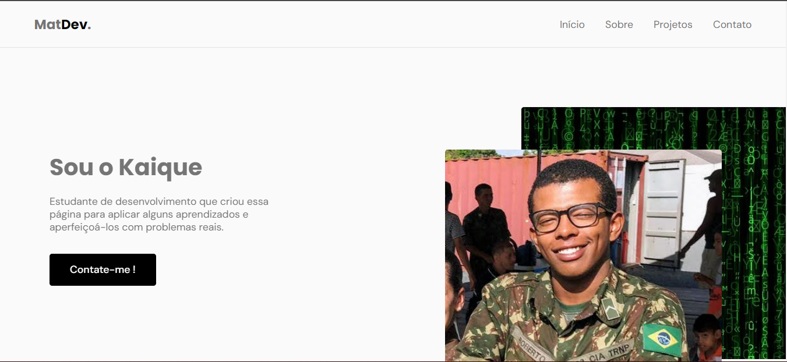

<h1 align="center"> MatDev Page </h1>

Criei uma pagina para além da apresentação pessoal mostrar um pouco dos meus conhecimentos na base da programação WEB.  

  <a href="#-tecnologias">Tecnologias</a>&nbsp;&nbsp;&nbsp;|&nbsp;&nbsp;&nbsp;
  <a href="#-projeto">Projeto</a>&nbsp;&nbsp;&nbsp;|&nbsp;&nbsp;&nbsp;
  <a href="#memo-licença">Licença</a>

  

 

  

## 🚀 Tecnologias

Esse projeto foi desenvolvido com as seguintes tecnologias:

- HTML e CSS
- JavaScript
- Git e Github

## 💻 Projeto

O MatDev Page é um portfolio pessoal para usar como cartão de visitas online.

- [Acesse o projeto finalizado, online](https://kaiquezulu.github.io/personalPagePrimitive/)

## :memo: Licença

Esse projeto está sob a licença MIT.

---

Feito com ♥ by Kaique Pires :nerd_face: 